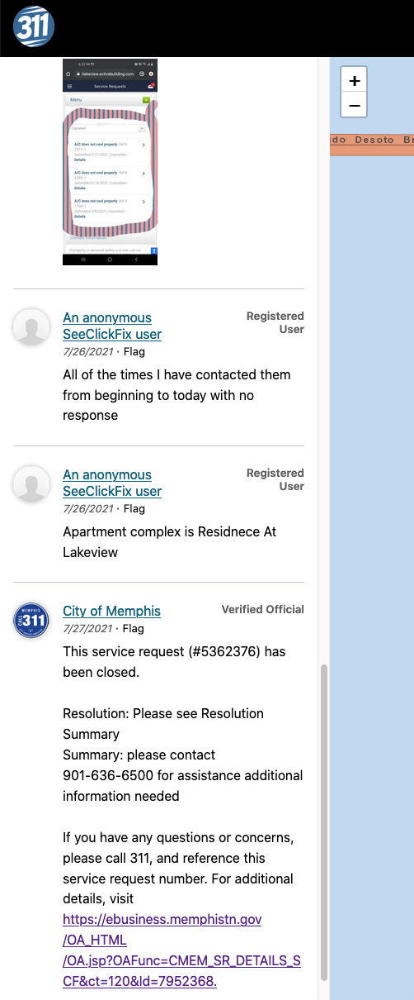
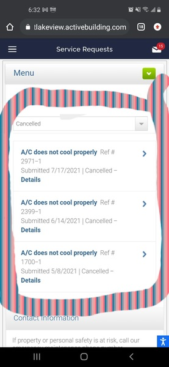
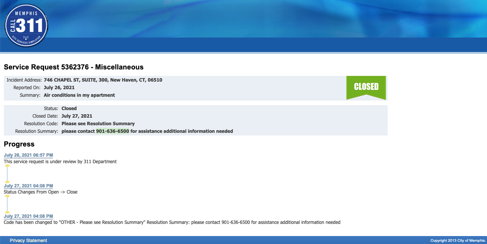

# 311 Data

Memphians are able to report problems to code enforcement by calling 311 or submitting a request through an app called [SeeClickFix](https://seeclickfix.com/), used in hundreds of towns across the nation.

Housing code enforcement data from 2016-present is available through [Memphis Data Hub](https://data.memphistn.gov/dataset/Service-Requests-since-2016/hmd4-ddta). This page uses a dataset downloaded July 19, 2021. At the time of download, there were 53 columns and 1,232,097 rows.

Considering the large number of rows and columns, this dataset might intimidate or dissuade individuals interested in the data who do not have the time to learn how to sort the data. Considering the extent of problems I had in parsing this data, I wanted to outline some basic advice and guidance for others interested in using this dataset.

R/RStudio was used to view and analyze the dataset, and all my code is available on the [Github repository](https://github.com/sj-io/MA-capstone) for this paper. I set out with a goal to not manually edit the data (such as retyping individual cells) instead opting to use r packages like [dplyr](https://dplyr.tidyverse.org/) to "wrangle" the data. This keeps the code reproducible, allowing anyone to download the newest 311 data and run it through the code to clean and organize it.

```{r getdata, include=FALSE, cache=TRUE}
library(tidyverse)
Service_Requests_since_2016 <-
  read_csv(
    "_data/Service_Requests_since_2016.csv",
    col_types = cols(
      ADDRESS2 = "c",
      ADDRESS3 = "c",
      COLLECTION_DAY = "c",
      CLOSE_DATE = col_datetime(format = "%m/%d/%Y %I:%M:%S %p"),
      CREATION_DATE = col_datetime(format = "%m/%d/%Y %I:%M:%S %p"),
      FOLLOWUP_DATE = col_datetime(format = "%m/%d/%Y %I:%M:%S %p"),
      INCIDENT_RESOLVED_DATE = col_datetime(format = "%m/%d/%Y %I:%M:%S %p"),
      LAST_MODIFIED_DATE = col_datetime(format = "%m/%d/%Y %I:%M:%S %p"),
      LAST_UPDATE_DATE = col_datetime(format = "%m/%d/%Y %I:%M:%S %p"),
      NEXT_OPEN_TASK_DATE = col_datetime(format = "%m/%d/%Y %I:%M:%S %p"),
      REPORTED_DATE = col_datetime(format = "%m/%d/%Y %I:%M:%S %p")
    )
  )
```

Each row of the 311 dataset contains all information for a single request, meaning there are not multiple rows for individual cases (except for duplicates).

Despite the large number of records, only a portion are relevant to this paper. This is because the dataset contains **all** requests to 311, not just those related to code enforcement. Additionally, many columns contain duplicate or unhelpful information. For instance, there are 23 columns related to location and under the column `LAST_UPDATED_BY`, every single entry is just the number "460101".

The dataset can be simplified by filtering for code enforcement data and narrowing the number of columns. The output is 14 columns and 154,844 rows, significantly easier to work with.

```{r CE, cache=TRUE}
CE <- Service_Requests_since_2016 %>%
  filter(DEPARTMENT == "Code Enforcement") %>%
  select(
    INCIDENT_NUMBER, #' service request (sr) number
    PARCEL_ID, #' parcel ID
    ADDRESS1, #' the street name & number
    REQUEST_TYPE, #' request category
    CE_CATEGORY, #' category for CE action
    RESOLUTION_CODE:RESOLUTION_SUMMARY, #' how the request resolved
    REQUEST_STATUS, #' open or closed?
    REPORTED_DATE, 
    LAST_MODIFIED_DATE, 
    OWNER_NAME, #' assigned code inspector
    CREATED_BY_USER,
    location1 #' geocoordinates
  ) %>% mutate(RESOLUTION_SUMMARY = str_to_lower(RESOLUTION_SUMMARY))
```

The above code chuck lists column names I kept which will be referenced below.

## Problems with the dataset

Prior to analyzing this dataset, know that there are significant problems that need correcting, including inconsistent and vague data entry, hard-to-filter duplicates, an error causing the wrong address to appear, and more.

Throughout the dataset, there are **multiple values that mean the same thing**, like closed and resolved[^ce-1]. The `RESOLUTION_CODE` field in particular has a handful of codes used for an umbrella of meanings. For instance, 23% of rows are resolved as "NJ" for Not Justified. This may mean an inspector has visited the property and did not see a problem, or there was a wrong address[^ce-2], or there was a problem and it's been fixed, or there was a problem but it wasn't related to code enforcement; but in most cases there is no further explanation given. There are similar problems for codes tagged CVOM (COMP. V.O. - Miscellaneous, 9% of all cases), CVOID (Closed Void, 4% cases), CO (Closed Other, 3%), and Other (1%). Together, these codes make up [40%]{.ul} of all code enforcement cases.

[^ce-1]: Resolved has only been used 72 times, which begs the question of whether it needs to exist at all.

[^ce-2]: INSUF (Insufficient information) is also used for wrong address cases.

Another field with this problem is `REQUEST_TYPE`. From 2016 to present, 29% of all requests were simply listed as "Code Miscellaneous".

Some problems are caused by a **lack of updates** on behalf of inspectors. A file may never be closed in the system, even though the inspector is finished looking at the case. There are 779 active cases created in 2018 or earlier (at least 2.5 years old) and it is unclear if some are in a lengthy legal battle or were simply never updated.

There are many many **duplicated entries**. It's hard to determine exactly how many, because the duplicates will have unique values under `INCIDENT_NUMBER` and slightly different date/times. For this reason it is hard to filter out without accidentally omitting multiple legitimate entries under the same property. Also, any entries that were created in error are kept in the system. This leads to inspectors frequently entering "see sr\#xxxxxx" in the `RESOLUTION_SUMMARY`, referring to a different `INCIDENT_NUMBER` that contains the correct file.[^ce-3] There is also a code specifically for duplicate entries that already have an active file, JA (Justified, Active already file), which has been used 6,588 times, though other codes are known to be used for this same problem.

[^ce-3]: There are 6,391 instances of a `RESOLUTION_SUMMARY` mentioning "sr", and nearly all of these rows are likely to be duplicates.

**Other problems are more major.** It appears that SeeClickFix (SCF), a program used to allow users to create requests, can cause the **wrong address** to be entered into the system. There is no warning given for this error. When I attempted to sort addresses with the most violations, the top address does not actually exist in the city of Memphis. The inspectors know this and they seem to be able to view the correct address in SCF, and sometimes (but not often) they will manually write this address in the `RESOLUTION_SUMMARY`. It is unclear how many addresses have this problem, but it does affect multiple addresses. As a researcher, I feel nervous conducting research on data with such obvious errors.

Each row is meant to hold all information for a single case. There is also only one column for inspectors to manually enter notes: `RESOLUTION_SUMMARY`. This column has become a **catch-all** for legitimate information, though it is also NA in 23% of rows. In many other cases there is little elaboration, or the `RESOLUTION_CODE_MEANING` is simply repeated. Despite having eight different date columns, it is very common for dates to be entered here with the notes. Because this field is typed, typos are not-uncommon---tenant is spelled "tennant" 51 times, with many other variations such as "tenenat", "tenet", "teneant" and "tenent". Other times a tenant is referred to as a "resident". These variances make it difficult to find all instances of keywords.

Lastly, there are also obvious **privacy issues** included in the field, such as the full name and phone numbers of individuals.

### Duplicates & Errors

Searching for duplicates is made difficult by the large number of errors in the dataset. This is made clear when we begin searching for addresses with the most service requests.

```{r echo=FALSE}
adr <- CE %>% count(ADDRESS1) %>% arrange(desc(n))
head(adr)
```

There are 194 entries listed under the address 746 Chapel St, an address that does not seem to exist in Memphis (there is a Chapel [Rd]{.ul}, but no 746). Reviewing the `RESOLUTION_SUMMARY` reveals the address to be a catch all of errors. Sometimes a different address or a business name is written in the `RESOLUTION_SUMMARY`, indicating the results we are seeing is not the same as what was originally entered, yet code inspectors may be able to view the correct address. It is likely best to remove this address from any analysis involving location.

At 1490 Hugenot St, there are 117 requests, but this property appears to have the same problem as 746 Chapel. This is revealed by certain entries in the `RESOLUTION_SUMMARY` including "The correct address is xxx Summer Ave." and "INSUFFICIENT INFORMATION WRONG ADDRESS SUBMITTED BY SEECLICKFIX" (SeeClickFix, or SCF, is listed as the request creator for all but five entries at this address).

As for 45 S Idlewild, this is a valid location (an apartment complex) with 117 service requests. A closer look shows three people made 20 requests on February 1, 2019. Yet as discussed below, it is not clear if we should trust the information seen in `CREATED_BY_USER`.

When we look closer at *who* is making complaints to code enforcement, it at first seems a few people are creating an astounding number of requests.[^ce-4]

[^ce-4]: SCF stands for SeeClickFix, an app to create service requests.

```{r echo=FALSE}
usr <- CE %>% count(CREATED_BY_USER) %>% arrange(desc(n))
head(usr)
```

However, filtering by HELEN.ANDERSON then "tenant" under `RESOLUTION_SUMMARY` shows multiple instances where someone not named "Helen Anderson" is mentioned as the contact person across a wide variety of addresses. Further investigation found that some of the people listed as request creators are actually inspectors.

## Basic Analysis

### Number of Requests

Below is the number of requests for each year between 2016 and 2021, not excluding duplicates.

| Reported Date           | Number of Requests |
|-------------------------|--------------------|
| 2016                    | 30,361             |
| 2017                    | 26,196             |
| 2018                    | 26,846             |
| 2019                    | 27,559             |
| 2020                    | 26,194             |
| 2021 (as of 07/19/2021) | 17,688             |

The number of requests remained relatively constant over the years.

### Active Cases

Below are cases that have not been marked "Closed."

| Year          | Active Cases |
|---------------|--------------|
| 2016          | 136          |
| 2017          | 111          |
| 2018          | 532          |
| 2019          | 956          |
| 2020          | 1,098        |
| 2021          | 5,630        |
| **All Years** | **8,463**    |

According to the dataset, there are still 779 active cases from 2018 or earlier. However, many cases seem to have been simply abandoned.

### Request Type

When a request is entered into 311, it must also be categorized. There are 14 categories for code enforcement data, including 3 categories related to COVID violations which were added in 2020. However, the vast majority of requests fell into one of five categories, listed below.

|                    Request Type | 2016    | 2017    | 2018    | 2019    | 2020    | 2021    |         All | Years   |
|--------------------------------:|---------|---------|---------|---------|---------|---------|------------:|---------|
|              Code Miscellaneous | 28%     | 32%     | 32%     | 31%     | 25%     | 25%     |  **45,028** | **29%** |
|               Vehicle Violation | 22%     | 26%     | 28%     | 26%     | 30%     | 35%     |  **42,249** | **27%** |
|                  Weeds Occupied | 20%     | 18%     | 17%     | 19%     | 14%     | 11%     |  **26,161** | **17%** |
|                      Junky Yard | 18%     | 13%     | 11%     | 12%     | 12%     | 15%     |  **21,283** | **14%** |
| Substandard, Derelict Structure | 9%      | 8%      | 10%     | 10%     | 7%      | 9%      |  **13,778** | **9%**  |
|                         **Sum** | **97%** | **97%** | **98%** | **98%** | **88%** | **95%** | **148,499** | **96%** |

From 2016 to 2019, more requests were sorted into "Miscellaneous" than any other category (surpassed by vehicle violations in 2020 and 2021). Considering that many cases related to housing are in this category, our job is made significantly harder. Rather that filtering and searching for a certain code, we are left to find these cases through a process of elimination.

## Tidying the Dataset

After collecting basic information about the dataset, I began to sort the data into bins. I created bins for duplicates and errors, requests related to yards or cars, and other rows irrelevant to this research, like COVID mask violations.

```{r eval=FALSE, include=FALSE}
#' sorry this section hasn't been organized/cleaned yet.
dupes <- CE %>% 
  filter(
    str_detect(
      RESOLUTION_SUMMARY, "sr|see#|service request|see #|duplicate") | 
      RESOLUTION_CODE == "JA")

errors <- CE %>% 
  filter(
    str_detect(
      RESOLUTION_SUMMARY, 
      "wrong address|incorrect address|not a good address|insufficient information|no such address|not enough information|wrong ticket|unknown code|no attachment"
      ) | RESOLUTION_CODE == "INSUF")

uhh <- CE %>% 
  filter(
    str_detect(
      RESOLUTION_SUMMARY, "901-"), !str_detect(RESOLUTION_SUMMARY, "please contact"))

yard <- CE %>% filter(
  str_detect(RESOLUTION_CODE, "CVOYC|VOYC") | 
    str_detect(REQUEST_TYPE, "Yard|Weeds"))
car <- CE %>% filter(
  str_detect(RESOLUTION_CODE, "CVOAR|VOAR|CVOAT") | 
    str_detect(REQUEST_TYPE, "Vehicle"))
SHELBY <- CE %>% 
  filter(RESOLUTION_CODE == "SHELBY" | 
  str_detect(RESOLUTION_SUMMARY, "shelby county"))
COVID <- CE %>% filter(str_detect(RESOLUTION_CODE, "COVID"))

tntmv <- CE %>% filter(str_detect(RESOLUTION_SUMMARY, "tenant"), str_detect(RESOLUTION_SUMMARY, "moved"))
```

Next I separated out rows where the `RESOLUTION_SUMMARY` provided no new information (usually duplicating the `REQUEST_CODE_MEANING`.

```{r eval=FALSE, include=FALSE}
noinfo <- CE %>% 
  filter(
    str_detect(
      RESOLUTION_SUMMARY, 
      "^comp. v.o. - miscellaneous$|^resolved$|^closed void$|^in compliance$|^closed, other$|^uncooperative$|^cvom$|^closed$|^vom$|^active npa case$|^dismissed$|^repaired$|^repairs made$|^administrative referral$|^jw-dm$|^jw-rh$|^case not justified$|^comp. v.o. bldg. repaired$|^not justified at the time of inspection$|^not justified$|^case dismissed$|^nj$|^closed, rehab$|^at the time of inspection the violation has been corrected$|^demolished by condemnation$|^violation has been corrected$|^close board and secure$|^not justified at time of inspection$|^not justified per inspection$|^corrected$|^incompliance$|^property rehabbed$|^rehabbed$"))

tidy2 <- CE %>% filter(
    !str_detect(
      RESOLUTION_SUMMARY, "^repaired$|^repairs made$|^comp. v.o. - miscellaneous$|^resolved$|^closed void$|^in compliance$|^closed, other$|^uncooperative$|^cvom$|^closed$|^vom$|^active npa case$|^dismissed$|sr|see#|service request|see #|^administrative referral$|^jw-dm$|^jw-rh$|^case not justified$|^comp. v.o. bldg. repaired$|^not justified at the time of inspection$|^not justified$|^case dismissed$|^nj$|duplicate|^closed, rehab$|wrong address|incorrect address|not a good address|insufficient information|no such address|not enough information|wrong ticket|unknown code|no attachment|^at the time of inspection the violation has been corrected$|^demolished by condemnation$|^violation has been corrected$|^close board and secure$|^not justified at time of inspection$|^not justified per inspection$|^corrected$|^incompliance$|shelby county|^property rehabbed$|^rehabbed$"
      ),
    !str_detect(RESOLUTION_CODE, "CVOYC|VOYC|CVOAR|VOAR|CVOAT|SHELBY|COVID|JA|INSUF"
    ),
    !str_detect(REQUEST_TYPE, "Yard|Weeds|Vehicle")
    )

tt2 <- tidy2 %>% count(RESOLUTION_SUMMARY) %>% arrange(desc(n))
tt3 <- tidy2 %>% count(RESOLUTION_CODE) %>% arrange(desc(n))
```

I also separated rows related to the legal process into their own bin. As I separated out bins, I finally began to see rows related to housing. I created a "building" bin, and directed the code to include rows that mentioned words like "roof," "flooring," "windows," or "carpet," which can only refer to a structure.

```{r eval=FALSE, include=FALSE}
admin <- CE %>% filter(str_detect(RESOLUTION_SUMMARY, "please contact|wrong department|thank you for") | RESOLUTION_CODE == "BACK TO MCSC")

#' RESOLUTION CODES
NJ <- CE %>% filter(RESOLUTION_CODE == "NJ") #' Not Justified
NPA <- CE %>% filter(str_detect(RESOLUTION_CODE, "NPA")) #' NPA 
legal <- CE %>% filter(str_detect(RESOLUTION_CODE, "HH|HD|CTCNT|SUMM|DISM|FM-7|FM12|NPF11|SC"))

#' STRUCTURE RELATED
bldg <- CE %>% filter(
  str_detect(RESOLUTION_CODE, "CR|CVOBR|JW-RH|CVOBD|CD") | 
    str_detect(RESOLUTION_SUMMARY, "roof|flooring|tenant|structural|windows|carpet"))

tidy <-
  CE %>% filter(
    !str_detect(RESOLUTION_SUMMARY, "sr|wrong address|please contact|refer to|see#|see #|service request|incorrect address|not a good address|insufficient information|no such address|roof|flooring|tenant|not enough information|wrong department|structural|wrong ticket|thank you for|^comp. v.o. - miscellaneous$|^resolved$|^closed void$|^in compliance$|^closed, other$|^uncooperative$|^cvom$|unknown code|no attachment|windows|carpet|^closed$|^vom$"), 
    !str_detect(RESOLUTION_CODE, "JA|CVOYC|NJ|CVOAR|NPA|SHELBY|VOYC|VOAR|CR|HH|HD|CTCNT|SUMM|CVOBR|CVOAT|DISM|JW-RH|FM-7|CVOBD|BACK TO MCSC|INSUF|FM12|NPF11|COVID|CD|SC"
    ),
    !str_detect(REQUEST_TYPE, "Yard|Weeds|Vehicle")
  )

t2 <- tidy %>% count(RESOLUTION_SUMMARY) %>% arrange(desc(n))
t3 <- tidy %>% count(RESOLUTION_CODE) %>% arrange(desc(n))
```

I then began searching for rows related to "tenant" which also included "moved" or "evict". Below is a table of such rows.

```{r echo=FALSE}
tntmv <- CE %>% 
  filter(
    str_detect(RESOLUTION_SUMMARY, "tenant|tennant|tenenat|tenet|teneant|tenent"), 
    str_detect(RESOLUTION_SUMMARY, " moved|evict")) %>% 
  arrange(desc(LAST_MODIFIED_DATE)) %>% 
  rename(sr = INCIDENT_NUMBER)

library(DT)
tntmv_tbl <- tntmv %>% select(sr, RESOLUTION_SUMMARY, ADDRESS1, REPORTED_DATE, everything())
datatable(tntmv_tbl)
```

The vast majority of cases in the table are filed under "Code Miscellaneous" (305 of 357 rows). Clearly there is opportunity for a new `REQUEST_TYPE` category to sort these rental-related cases.

In the above table, sr \#4569338 seems relevant to this paper

> per: tenant jessica they moved due to respiratory problems from the mold/mildew like substance

From here I created a separate table to search for rows related to "mold".

```{r echo=FALSE}
mold <- CE %>% 
  filter(
    str_detect(RESOLUTION_SUMMARY, "mold")) %>% 
  arrange(desc(LAST_MODIFIED_DATE)) %>% 
  rename(sr = INCIDENT_NUMBER) 

mold_tbl <- mold %>% select(sr, RESOLUTION_SUMMARY, ADDRESS1, REPORTED_DATE, everything())
datatable(mold_tbl) 
```

This search showed that many cases involving tenants do not mention the word tenant. Sometimes "occupant" or "resident" is used. Other times they are never mentioned; the summary may state a notice was sent to the owner, or make no mention of people at all. This makes it very hard to find information specifically about rental units.

## SeeClickFix

Another way to view service requests is through Memphis's [SeeClickFix](https://seeclickfix.com/web_portal/DaM5B2x33WeFNJ1zpUeDRvCB/issues/map?lat=35.14896833842707&lng=-90.05163922905923&max_lat=35.15402992416014&max_lng=-90.04691720008852&min_lat=35.143906437842766&min_lng=-90.05635857582094&zoom=17) website. Below we can see how 311 handled a [service request](https://seeclickfix.com/web_portal/DaM5B2x33WeFNJ1zpUeDRvCB/issues/10508076) from a tenant who has been without air conditioning since May.

|                      |                                   |
|----------------------|-----------------------------------|
|  | {width="498"} |

The tenant provided multiple photos (not all shown here) proving attempts to contact maintenance, which had been canceled or marked as completed though they were not resolved.

|                      |                      |
|----------------------|----------------------|
|  |  |

Almost immediately, the city closed the request, redirecting the tenant to call a phone number for the Mayor's Citizen Service Center. According to the [City of Memphis's website](https://www.memphistn.gov/government/mayor-jim-strickland/mayors-citizen-service-center-311/), **the Mayor's Citizen Service Center is 311**. So it appears 311 closed the request, telling the tenant to contact 311.



This was also a case where the incident address was filled in as the 746 Chapel Street, mentioned above as having the most service requests of any address. We can now see the default address is actually in Connecticut.

Unfortunately, this request only revealed additional hurdles in interacting with code enforcement data.
